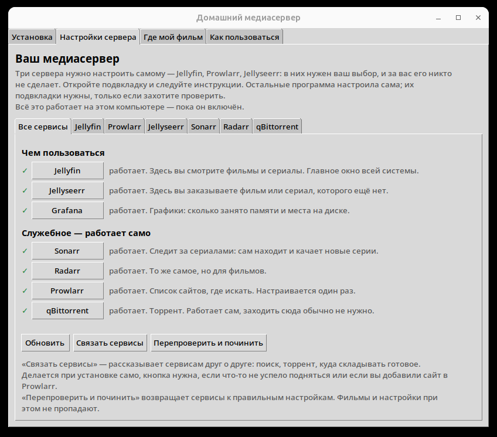

# home-media-k3s

Домашний медиасервер, который ставится одним файлом на компьютер человека, не
умеющего в командную строку. Внутри — Kubernetes: шесть сервисов в кластере k3s,
а не шесть контейнеров «как-нибудь».

Стек обычный для домашней медиатеки: **Jellyfin** (смотреть), **Jellyseerr**
(заказывать), **Sonarr** и **Radarr** (искать и раскладывать), **Prowlarr** (где
искать), **qBittorrent** (качать). Необычное здесь — способ доставки: то же
самое, что обычно живёт в `docker-compose.yml` на NAS, здесь оформлено как
продукт с установщиком, предпроверками, конвейером сборки и релизами.



Одно окно вместо шести вкладок браузера: программа сама опрашивает сервисы и
пишет по-человечески, что работает, а что нет.

```
                     ┌──────────────────────────────────────────┐
  окно установщика   │  home-media-k3s (Python + tkinter)       │
  (никакого браузера)│  проверки · установка · статус · заказы  │
                     └───────────────┬──────────────────────────┘
                                     │ ставит и опрашивает
                     ┌───────────────▼──────────────────────────┐
                     │  k3s, одна нода, namespace media         │
                     │                                          │
                     │  jellyfin  jellyseerr  sonarr   radarr   │
                     │   :30096     :30055    :30989   :30878   │
                     │  prowlarr  qbittorrent                   │
                     │   :30696     :30880    (+ grafana :30030)│
                     └───────────────┬──────────────────────────┘
                                     │ hostPath
                     ┌───────────────▼──────────────────────────┐
                     │  папки, которые выбрал пользователь      │
                     │  фильмы: downloads + library/{tv,movies} │
                     │  настройки: по папке на сервис           │
                     └──────────────────────────────────────────┘

  k3s ставится прямо в систему, службой systemd
```

## Что здесь интересного

**Одна таблица портов на весь проект.** Стек существует в двух формах — стенд на
трёх виртуальных машинах с `kubeadm`, где всё разрабатывается, и `k3s` на машине
пользователя. Формы обязаны разъехаться: где-то Sonarr на 8989, где-то на 30989,
в документации третье. Поэтому таблица одна, в [`app/config.py`](app/config.py), а
CI сверяет с ней собранные манифесты и роняет сборку при расхождении.

**k3s-форма — оверлей kustomize, а не копия манифестов.**
[`deploy/k3s/`](deploy/k3s/) собирается поверх [`k8s/media-stack/`](k8s/media-stack/)
и расходится с ним ровно в трёх местах, каждое из которых объяснено прямо в
`kustomization.yaml`. Копия означала бы два источника истины на два десятка файлов.

**Тома — hostPath в папках пользователя, а не динамические.** У `k3s` есть свой
провижинер, но он кладёт данные в `/var/lib/rancher/k3s/storage/<uuid>/` — то
есть не туда, куда человек показал пальцем, и не туда, где приложение потом
найдёт ключи API сервисов. Тома генерируются при установке из
[шаблона](deploy/k3s/hostpath-volumes.yaml.tmpl) с выбранными путями.

**Пароль торрента рождается при установке.** В репозитории его нет: иначе он был
бы один на всех, кто скачал релиз. PBKDF2-хеш считается
[в одном месте](app/install.py) — его вызывает и приложение, и скрипт стенда.

**Программа настраивает сервисы друг на друга сама.** После установки Sonarr,
Radarr и Prowlarr ничего друг о друге не знают: торрент, ключи и корневые папки
человек обычно переносит руками между четырьмя чужими интерфейсами — это полчаса
кликов, и каждый шаг можно молча сделать не так. [`app/wire.py`](app/wire.py)
делает это по их API, беря шаблон настроек из их же `/schema`, а не выдумывая
набор полей. Повторный вызов ничего не задваивает — кнопку нажмут дважды.

**Смена папки после установки не теряет медиатеку.** Фильм в библиотеке и его
скачанная копия — один файл под двумя именами; обычный перенос через границу
файловых систем превращает их в два и тихо удваивает занятое место. Перенос
строит карту inode и восстанавливает связи, а исходник удаляет только после
удавшегося копирования: не хватило места — всё возвращается назад.

**Проверку «вы не робот» проходит сам.** Крупные трекеры стоят за Cloudflare, и
на запрос от программы он отдаёт не страницу, а задачу на JavaScript с заголовком
`cf-mitigated: challenge`. Prowlarr — HTTP-клиент, а не браузер, поэтому получает
`403` и пишет «Unable to connect to indexer» — при том что сайт открывается у
человека в браузере на той же машине. В стеке для этого есть седьмой сервис,
[FlareSolverr](k8s/media-stack/flaresolverr/): он держит headless-браузер, решает
задачу и отдаёт куки. Наружу он не смотрит вовсе — единственный `ClusterIP` в
стеке, — а прописывает его в Prowlarr [`app/wire.py`](app/wire.py) вместе с
меткой `flaresolverr`. Метка нужна с обеих сторон — и на прокси, и на индексере:
измерено, что прокси применяется только к помеченным индексерам, а без метки
запрос уходит напрямую и получает `403` за две секунды. Индексеры человек
добавляет сам и уже после установки, поэтому `wire.tag_indexers()` помечает те,
что есть на момент запуска, — кнопка «Связать сервисы» и есть способ пометить
только что добавленный сайт.

**У приложения нет зависимостей.** Интерфейс на `tkinter`, клиенты API на
`urllib`, разбор состояний — свой. Ставить перед запуском нечего, бандл весит
единицы мегабайт.

**Проверки, доказывающие провал.** Скрипты стенда обязаны содержать негативный
тест — запись под `root_squash` в NFS, вход с неверным паролем qBittorrent.
Успешный результат там означает провал проверки.

## Установка

Скачайте файл со страницы
[Releases](https://github.com/sher2yja/home-media-k3s/releases) и запустите —
откроется окно установки. Нужен Linux с `systemd`, всё остальное программа
поставит сама. Подробно, по шагам и без жаргона — в [MANUAL.md](MANUAL.md).

Версии для Windows пока нет. Путь через WSL2 был написан, но проверять его было
не на чем, а выкладывать непроверенное как рабочее — обещание, за которое некому
отвечать. Он вернётся отдельной работой.

## Как устроен репозиторий

| Каталог | Что там |
|---|---|
| [`app/`](app/) | приложение: окно, установка, опрос сервисов. Оно же таблица портов и путей |
| [`k8s/media-stack/`](k8s/media-stack/) | манифесты семи сервисов — общая часть обеих форм |
| [`k8s/monitoring/`](k8s/monitoring/) | Prometheus, Grafana, node-exporter: профиль «полный» |
| [`deploy/k3s/`](deploy/k3s/) | оверлей и шаблон томов для машины пользователя |
| [`deploy/k3s/monitoring/`](deploy/k3s/monitoring/) | оверлей мониторинга: снимает `nodeSelector` стенда |
| [`ansible/`](ansible/) | разворачивание стенда: виртуальные машины, кластер, NFS |
| [`infra/vms/scripts/`](infra/vms/scripts/) | проверки стенда на bash, с негативными тестами |
| [`.github/workflows/`](.github/workflows/) | проверки, сборка, e2e на живом k3s, релизы |

Собрать и запустить из исходников, а также что именно приложение делает под
капотом — в [DEVELOPMENT.md](DEVELOPMENT.md).

## Конвейер

Каждый push проходит проверки: линтер, самопроверки разбора, синтаксис YAML и
bash, сборка оверлея, сверка портов с таблицей, сборка окна в виртуальном
X-сервере. На `master` и тегах добавляется **e2e**: на чистой машине ставится
настоящий k3s, запускается тот же код установки, что у пользователя, и все шесть
сервисов опрашиваются тем же кодом, которым это делает окно приложения.

Приложение собирается только конвейером. Релиз выкладывает ровно тот артефакт,
который прошёл проверки, — пересборки на этом шаге нет.
